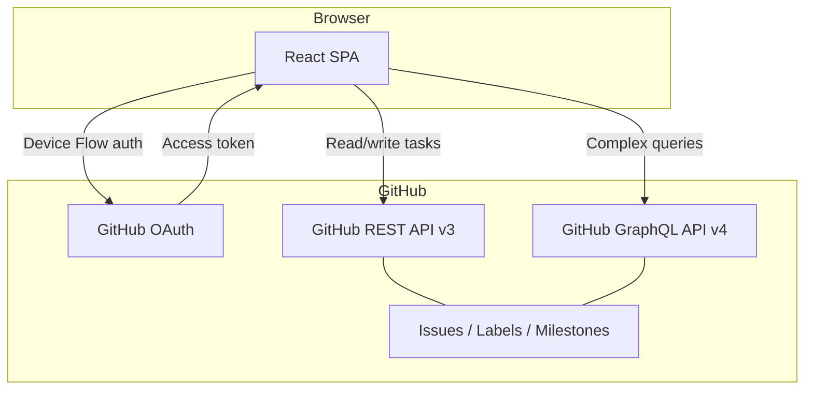
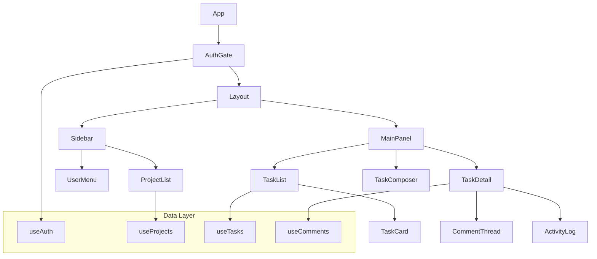
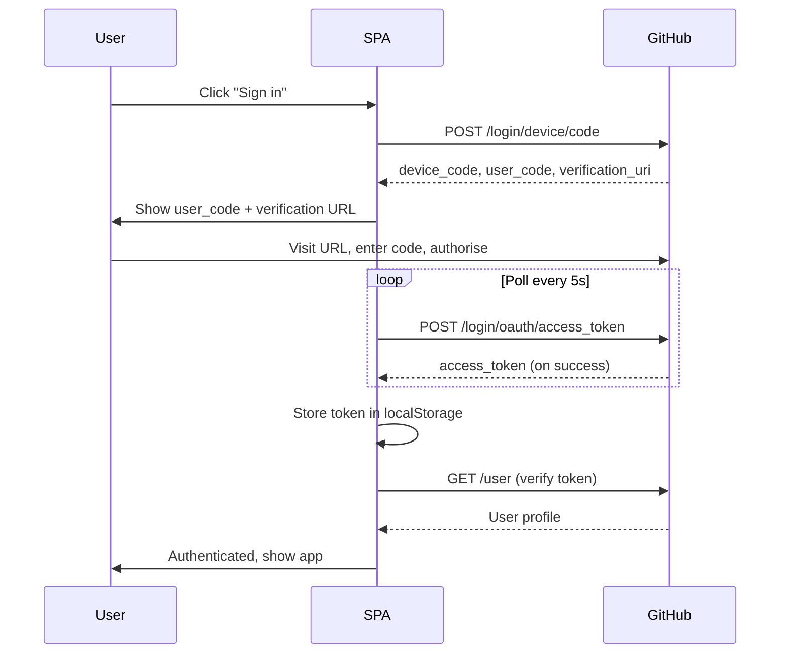
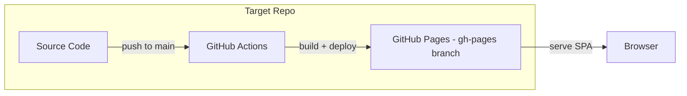

# High Level Design — Todo App

| Field | Value |
|---|---|
| Document ID | TODO-HLD-001 |
| Version | 1.0 |
| Status | Draft |
| Author | Platform Team |
| References | TODO-URS-001 |

---

## 1. Architecture Overview

The Todo App is a single-page application (SPA) that uses GitHub as its sole backend. Task data is stored as GitHub Issues, projects map to GitHub Milestones, and labels map directly to GitHub Labels. Authentication is handled via GitHub OAuth. No custom server or database is required.

---

## 2. Component Architecture

---

## 3. Data Mapping

The Todo App maps its domain model onto GitHub primitives:

| Todo Concept | GitHub Primitive | Notes |
|---|---|---|
| Task | Issue | Title, body, assignees, labels, milestone |
| Project | Milestone | Title, description, due date |
| Label | Label | Name, colour, description |
| Comment | Issue Comment | Body (markdown) |
| Assignee | Issue Assignee | GitHub user |
| Priority | Label (prefixed `priority:`) | e.g. `priority:high` |
| Status | Issue open/closed state | Open = active, Closed = complete |
| Activity | Issue Timeline Events | Via GraphQL `timelineItems` |

---

## 4. Authentication Flow

---

## 5. Technology Stack

| Layer | Choice | Rationale |
|---|---|---|
| Frontend framework | React 18 | Component model, hooks, broad ecosystem |
| Build tool | Vite | Fast HMR, static output for GitHub Pages |
| Language | TypeScript (strict) | Type safety, IDE support |
| Styling | Tailwind CSS | Utility-first, no runtime |
| Server state | TanStack Query | Caching, background refetch, optimistic updates |
| API | Octokit (REST + GraphQL) | Official GitHub SDK |
| Hosting | GitHub Pages | Zero-cost, co-located with data |
| Auth | GitHub OAuth Device Flow | No redirect server needed |

---

## 6. Deployment Architecture

The GitHub Actions workflow builds the Vite SPA on every push to `main` and deploys the `dist/` output to the `gh-pages` branch. GitHub Pages serves the static files directly to users.

---

## 7. Key Design Decisions

- **No custom backend:** Using GitHub Issues as the data store eliminates infrastructure cost and keeps data in the same system as code. Accepted trade-off: GitHub API rate limits (5,000 req/hr per token) constrain scale.
- **Optimistic updates:** Task state changes (complete, assign) are applied immediately in the UI and rolled back on API failure to give a responsive feel.
- **Label-based metadata:** Priority, status tags, and category labels are stored as GitHub Labels with naming conventions (e.g. `priority:high`). This keeps the data model simple at the cost of some label namespace pollution.
