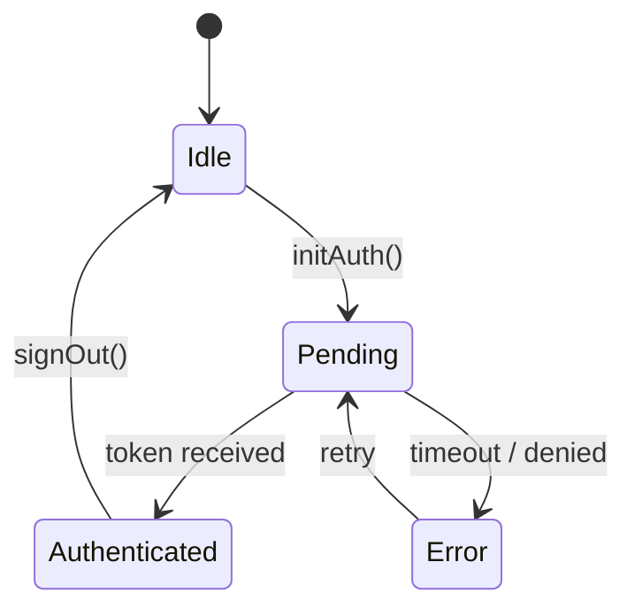

# Low Level Design — Todo App

| Field | Value |
|---|---|
| Document ID | TODO-LLD-001 |
| Version | 1.0 |
| Status | Draft |
| Author | Platform Team |
| References | TODO-HLD-001 |

---

## 1. Module Breakdown

### 1.1 `useAuth` Hook

Manages GitHub OAuth Device Flow lifecycle.

**State machine:**



**Interface:**
```typescript
interface AuthState {
  status: 'idle' | 'pending' | 'authenticated' | 'error'
  userCode?: string
  verificationUrl?: string
  token?: string
  user?: GitHubUser
  error?: string
}

function useAuth(clientId: string): {
  state: AuthState
  initAuth: () => Promise<void>
  signOut: () => void
}
```

---

### 1.2 `useTasks` Hook

Fetches and caches GitHub Issues as tasks. Applies label-based filtering for priority and project membership.

**Query key structure:** `['tasks', owner, repo, filters]`

**Filter shape:**
```typescript
interface TaskFilters {
  milestoneId?: number    // maps to project
  assignee?: string       // GitHub login
  labels?: string[]       // e.g. ['priority:high']
  state?: 'open' | 'closed' | 'all'
  sort?: 'created' | 'updated' | 'due_date'
}
```

**Optimistic update flow for task completion:**
1. `onMutate`: snapshot current cache, apply closed state immediately
2. `mutationFn`: call `PATCH /repos/{owner}/{repo}/issues/{number}` with `state: 'closed'`
3. `onError`: rollback to snapshot
4. `onSettled`: invalidate `['tasks', ...]` to refetch

---

### 1.3 `TaskCard` Component

Renders a single task in the list view.

**Props:**
```typescript
interface TaskCardProps {
  task: Task
  onComplete: (id: number) => void
  onSelect: (id: number) => void
  isSelected: boolean
}
```

**Layout:**
```
┌─────────────────────────────────────────────┐
│ ○  Task title                    P: High  ▸ │
│    Assigned to @dana · Due Jun 30           │
└─────────────────────────────────────────────┘
```

Clicking the circle (`○`) triggers `onComplete`. Clicking the row triggers `onSelect` (opens detail panel).

---

### 1.4 `TaskDetail` Component

Right-panel detail view for a selected task.

**Sections:**
1. **Header** — title (editable inline), status badge, close button
2. **Meta** — assignee picker, due date picker, priority selector, label list
3. **Description** — markdown editor (write/preview tabs)
4. **Activity** — chronological list of comments + timeline events (assignments, label changes, state changes)
5. **Comment composer** — markdown textarea + submit

**Inline edit pattern:** All meta fields use click-to-edit. On blur or Enter the field saves immediately via optimistic update.

---

## 2. Data Model

### 2.1 Task (mapped from GitHub Issue)

```typescript
interface Task {
  id: number               // GitHub issue number
  title: string
  body: string             // markdown
  state: 'open' | 'closed'
  assignees: GitHubUser[]
  labels: Label[]
  milestone: Milestone | null  // maps to Project
  createdAt: string
  updatedAt: string
  closedAt: string | null
  dueDate: string | null   // extracted from label `due:YYYY-MM-DD` or body frontmatter
  priority: 'critical' | 'high' | 'medium' | 'low' | null  // from `priority:*` label
  url: string
}
```

### 2.2 Project (mapped from GitHub Milestone)

```typescript
interface Project {
  id: number
  title: string
  description: string
  dueOn: string | null
  openTaskCount: number
  closedTaskCount: number
  state: 'open' | 'closed'
}
```

---

## 3. API Interaction Patterns

### 3.1 Fetching Tasks

```
GET /repos/{owner}/{repo}/issues
  ?milestone={milestoneNumber}
  &assignee={login}
  &labels={comma-separated}
  &state=open
  &per_page=50
  &sort=updated
```

Pagination handled via `Link` header (`rel="next"`). TanStack Query `useInfiniteQuery` manages pages.

### 3.2 Creating a Task

```
POST /repos/{owner}/{repo}/issues
Body: {
  title: string,
  body: string,
  assignees: string[],
  labels: string[],
  milestone: number | null
}
```

### 3.3 Label Conventions

| Purpose | Naming Pattern | Example |
|---|---|---|
| Priority | `priority:{level}` | `priority:high` |
| Due date | `due:{YYYY-MM-DD}` | `due:2026-07-15` |
| Category | `cat:{name}` | `cat:backend` |
| Area | `area:{name}` | `area:auth` |

---

## 4. Error Handling

| Scenario | Handling |
|---|---|
| 401 Unauthorized | Clear token, redirect to sign-in |
| 403 Forbidden | Show "insufficient permissions" message; do not retry |
| 404 Not Found | Show empty state; log to console in dev |
| 422 Validation | Parse GitHub error message, surface to user inline |
| 429 Rate Limited | Back-off with `Retry-After` header; show toast with countdown |
| 5xx Server Error | Retry up to 3 times with exponential back-off; show error banner |

---

## 5. Performance Considerations

- **Stale-while-revalidate:** Task lists use `staleTime: 30_000` — background refetch every 30s
- **Selective invalidation:** Completing a task only invalidates the affected milestone's task list, not all tasks
- **Pagination:** Maximum 50 tasks per page; virtual scroll for lists > 100 items
- **Debounce:** Search input debounced at 300ms before triggering API call
