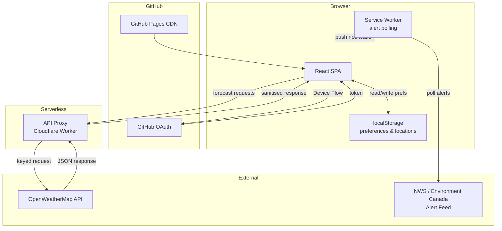
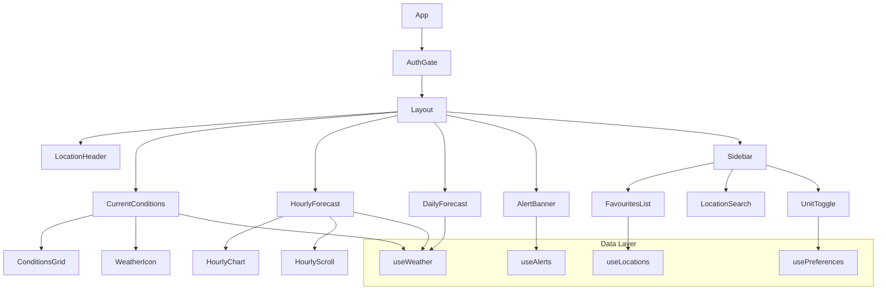
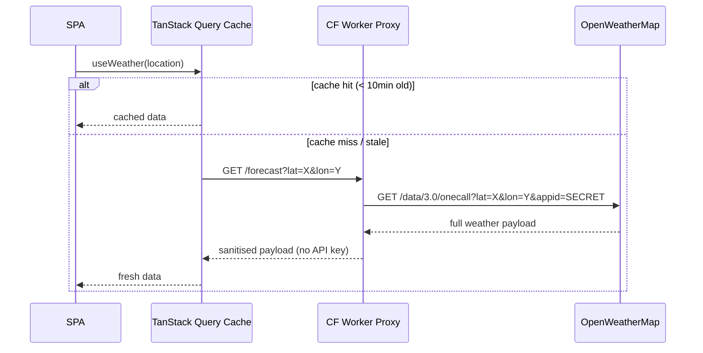
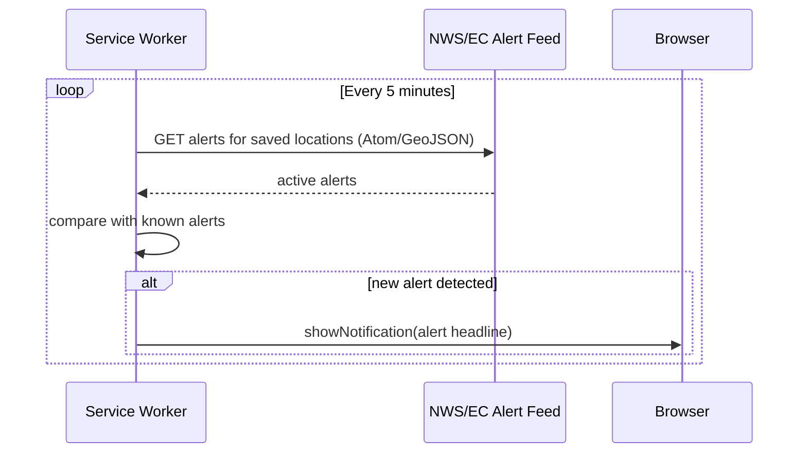
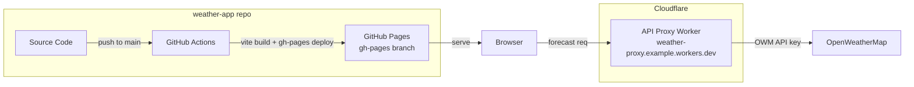

# High Level Design — Weather App

| Field | Value |
|---|---|
| Document ID | WTHR-HLD-001 |
| Version | 1.0 |
| Status | Draft |
| Author | Platform Team |
| References | WTHR-URS-001 |

---

## 1. Architecture Overview

The Weather App is a static SPA that fetches weather data from a commercial weather API via a thin serverless proxy (to protect the API key from browser exposure). User preferences and saved locations are stored in the browser's `localStorage`. Severe alert polling runs as a background service worker. The app is deployed to GitHub Pages.

---

## 2. Component Architecture

---

## 3. Data Flow

### 3.1 Forecast Data Flow

### 3.2 Alert Polling Flow

---

## 4. Technology Stack

| Layer | Choice | Rationale |
|---|---|---|
| Frontend framework | React 18 | Component model, rich ecosystem |
| Build tool | Vite | Fast dev, static output for GitHub Pages |
| Language | TypeScript (strict) | Type safety across API response shapes |
| Styling | Tailwind CSS | Utility-first, no runtime |
| Charts | Recharts | Composable, accessible charts for forecast visualisation |
| Server state | TanStack Query | Caching with stale-time, background refetch |
| Hosting | GitHub Pages | Zero-cost static hosting |
| Auth | GitHub OAuth Device Flow | No redirect server; works with static hosting |
| API proxy | Cloudflare Worker | Free tier, edge-cached, protects API key |
| Alert polling | Service Worker | Background polling without tab needing to be focused |
| Weather data | OpenWeatherMap One Call 3.0 | Comprehensive: current + hourly + daily + alerts |

---

## 5. Deployment Architecture

The Cloudflare Worker acts as a thin, stateless proxy — it adds the `appid` query parameter and forwards the response. No data is stored in the worker. The API key is stored as a Cloudflare Worker Secret.

---

## 6. Key Design Decisions

- **API proxy instead of direct browser calls:** Exposing the weather API key in the browser would allow abuse and cost overruns. A serverless proxy adds negligible latency while protecting the key.
- **Service Worker for alert polling:** Polling from the main SPA thread would stop when the tab is hidden on mobile. A Service Worker continues running and can deliver push notifications even when the app is backgrounded.
- **localStorage for user preferences:** Weather preferences (unit, saved locations, default) are lightweight and user-specific. Using GitHub Discussions or Issues for this would over-engineer a simple problem.
- **OpenWeatherMap One Call 3.0:** Single API call returns current conditions, hourly, daily, minutely precipitation, and national weather alerts — minimising round trips and simplifying the data model.
